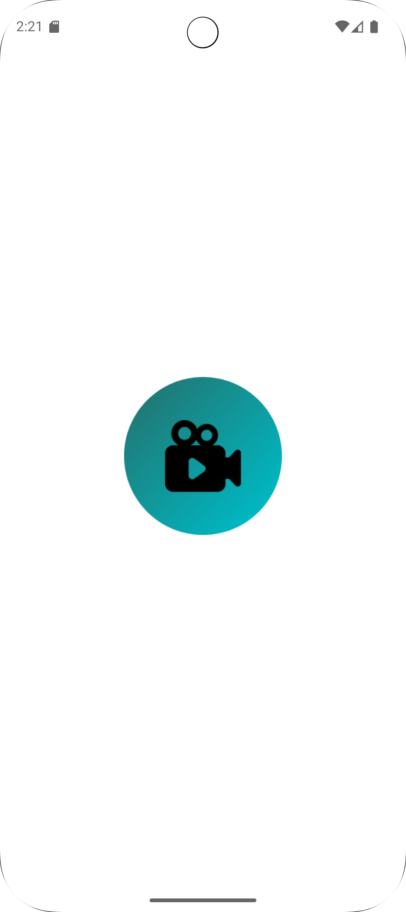
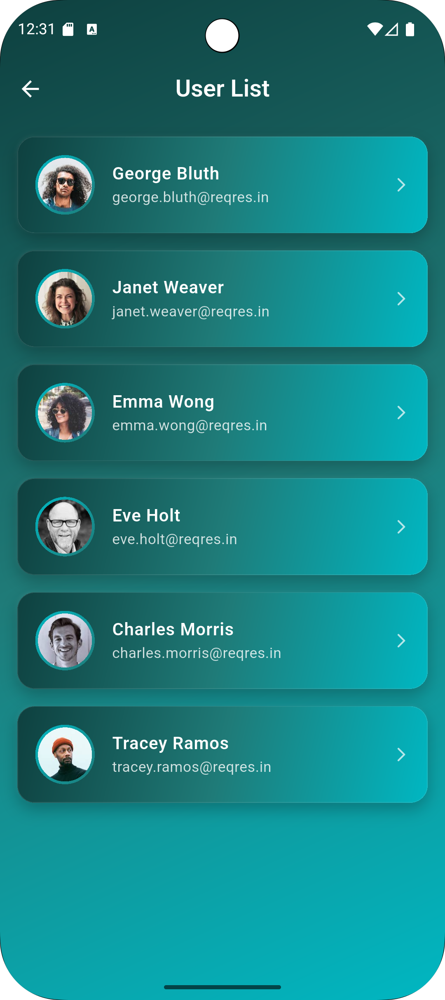
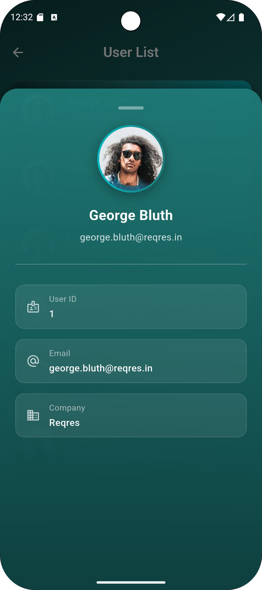

# 🎯 Hipster Flutter Assignment – Agora Video App

**Modern Flutter application demonstrating one-to-one video calls, REST API user management, and store-ready design using Agora SDK. Built with BLoC pattern for robust state management. Local storage is implemented with Hive.**

---

## 🧩 Project Overview

This Flutter application showcases:

* Splash screen and app launch flow
* Secure **email/password login** with validation
* REST API **user list screen** with offline caching using **Hive**
* **One-to-one video call** using **Agora RTC Engine**
* Proper **BLoC-based state management** and **error handling**
* Store-ready configurations (permissions, icons, versioning)

---

## ✨ Features

### 1. Splash Screen

* Animated logo launch screen
* Automatically navigates to Login screen

### 2. Login Screen

* Email and password input
* Validation: empty fields + email format
* Mock authentication via **ReqRes API** or hardcoded credentials
* Login flow managed using **AuthBloc**

### 3. User List Screen

* Fetches user data from fake REST API
* Shows avatar + name in scrollable list
* **Offline caching using Hive**
* Pull-to-refresh to reload data
* State handled via **UserBloc**

### 4. One-to-One Video Call

* Built with **Agora RTC Engine**
* Join call using **hardcoded meeting/channel ID**
* Audio mute/unmute & video enable/disable
* Handles **camera/microphone permissions**
* Works on Android and iOS
* Call logic managed via **VideoBloc**

---

## 🛠️ Tech Stack

| Feature          | Technology                   |
| ---------------- | ---------------------------- |
| Framework        | Flutter (latest stable)      |
| Language         | Dart                         |
| Video SDK        | Agora RTC Engine             |
| State Management | BLoC Pattern                 |
| REST API         | ReqRes                       |
| Local Storage    | Hive                         |
| Permissions      | Camera, Microphone, Internet |

---

## ⚙️ Getting Started

### Prerequisites

* Flutter SDK ≥ 3.10
* Dart SDK ≥ 3.0
* Android Studio / VS Code with Flutter plugin

### Installation

```bash
# Clone repository
git clone https://github.com/jeetparmar2810/Hipster-Flutter-Assignment.git
cd Hipster-Flutter-Assignment

# Install dependencies
flutter pub get

# Run on device or emulator
flutter run
```

---

## 📡 Agora RTC Setup

1. Create an **Agora developer account**
2. Generate **App ID**
3. Add **App ID** in `agora_service.dart`
4. Run on **two devices/emulators** to test one-to-one video calls
5. Ensure camera & microphone permissions are added in:

    * **Android:** `AndroidManifest.xml`
    * **iOS:** `Info.plist`

---

## 🖼️ Screenshots

<div align="center">
  
  
  
  
</div>

---

## 🧩 Key BLoC Components

| Screen / Feature | BLoC      |
| ---------------- | --------- |
| Login            | AuthBloc  |
| User List        | UserBloc  |
| Video Call       | VideoBloc |

> All API calls, state changes, and UI updates are handled via **BLoC** for a clean separation of concerns.

---

## 📄 Build & Deployment

### Android

```bash
flutter build apk --release
```

### iOS

```bash
flutter build ios --release
```

> Make sure camera and microphone permissions are enabled in both platform manifests.

---

## 🧠 Assumptions & Limitations

* Meeting ID and credentials are **hardcoded** for demo purposes
* API data fetched from **ReqRes** (no backend setup required)
* Screen sharing may depend on SDK and platform support

---

## 🤝 Contributing

Contributions are welcome!

1. Fork the repo
2. Create your feature branch (`feature/my-feature`)
3. Commit changes (`git commit -m 'Add some feature'`)
4. Push to branch (`git push origin feature/my-feature`)
5. Open a Pull Request

---

## 📄 License

This project is licensed under the **MIT License** — see the [LICENSE](LICENSE) file for details.

---

## 📞 Contact

**Jeet Parmar**
📧 [jeet.mobiledeveloper@gmail.com](mailto:jeet.mobiledeveloper@gmail.com)
🌐 [Portfolio Website](https://jeetparmar2810.github.io/portfolio/index.html)
💼 [LinkedIn](https://www.linkedin.com/in/jeet-parmar-a37b0b98/)

---

**Made with ❤️ using Flutter, BLoC, Hive, and Agora RTC Engine**
