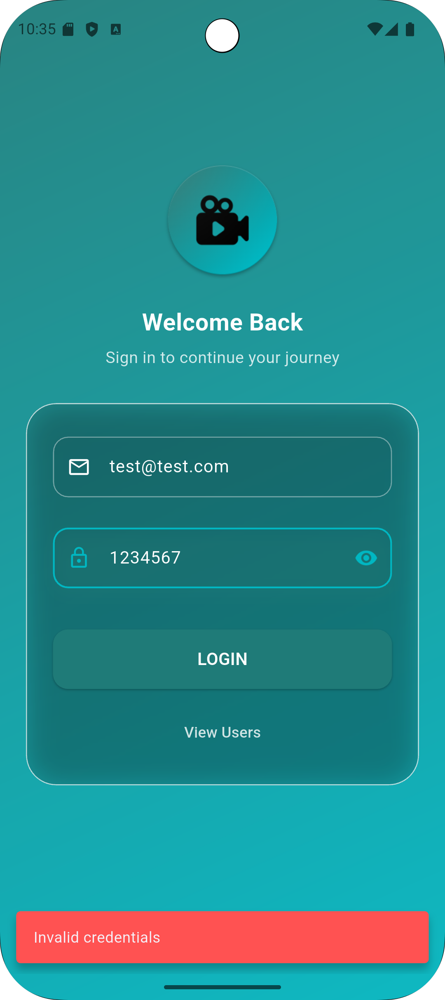

# 🎯 Hipster Flutter Assignment – Agora Video App

**Modern Flutter application demonstrating one-to-one video calls, REST API user management, and store-ready design using Agora SDK. Built with BLoC pattern for robust state management. Local storage is implemented with Hive.**

---

## 🧩 Project Overview

This Flutter application showcases:

- Splash screen and app launch flow
- Secure **email/password login** with validation
- REST API **user list screen** with offline caching using **Hive**
- **One-to-one video call** using **Agora RTC Engine**
- Proper **BLoC-based state management** and **error handling**
- Store-ready configurations (permissions, icons, versioning)

---

## ✨ Features

### 1. Splash Screen
- Animated logo launch screen
- Automatically navigates to Login screen

### 2. Login Screen
- Email and password input
- Validation: empty fields + email format
- Mock authentication via **ReqRes API** or hardcoded credentials
- Login flow managed using **AuthBloc**

### 3. User List Screen
- Fetches user data from fake REST API
- Shows avatar + name in scrollable list
- **Offline caching using Hive**
- Pull-to-refresh to reload data
- State handled via **UserBloc**

### 4. One-to-One Video Call
- Built with **Agora RTC Engine**
- Join call using **hardcoded meeting/channel ID**
- Show **local camera feed** and **remote participant**
- Audio mute/unmute & video enable/disable
- Handles **camera/microphone permissions**
- Works on Android and iOS
- Call logic managed via **VideoBloc**

---

## 🛠️ Tech Stack

| Feature          | Technology                   |
|------------------|------------------------------|
| Framework        | Flutter (latest stable)      |
| Language         | Dart                         |
| Video SDK        | Agora RTC Engine             |
| State Management | BLoC Pattern                 |
| REST API         | ReqRes                       |
| Local Storage    | Hive                         |
| Permissions      | Camera, Microphone, Internet |

---

## ⚙️ Getting Started

### Prerequisites
- Flutter SDK ≥ 3.10
- Dart SDK ≥ 3.0
- Android Studio / VS Code with Flutter plugin

### Installation

```bash
# Clone repository
git clone https://github.com/jeetparmar2810/Hipster-Flutter-Assignment.git
cd Hipster-Flutter-Assignment

# Install dependencies
flutter pub get

# Run on device or emulator
flutter run


📡 Agora RTC Setup

Create an Agora developer account

Generate App ID

Add App ID in agora_service.dart

Run on two devices/emulators to test one-to-one video calls

Ensure camera & mic permissions are added in:

Android: AndroidManifest.xml

iOS: Info.plist

🖼️ Screenshots
<div align="center">     </div>
🧩 Key BLoC Components
Screen / Feature	BLoC
Login	AuthBloc
User List	UserBloc
Video Call	VideoBloc

All API calls, state changes, and UI updates are handled via BLoC for a clean separation of concerns.

🧩 Bonus Features

Mute/unmute audio & enable/disable video

Offline caching for user list using Hive

Graceful handling of app lifecycle (background, orientation changes)

📄 Build & Deployment
Android
flutter build apk --release

iOS
flutter build ios --release


Make sure camera and microphone permissions are enabled in both platform manifests.

🧠 Assumptions & Limitations

Meeting ID and credentials are hardcoded for demo purposes.

API data fetched from ReqRes (no backend setup required).

Screen sharing may depend on SDK and platform support.

🤝 Contributing

Contributions are welcome!

Fork the repo

Create your feature branch (feature/my-feature)

Commit changes (git commit -m 'Add some feature')

Push to branch (git push origin feature/my-feature)

Open a Pull Request

📄 License

This project is licensed under the MIT License — see the LICENSE
 file for details.

📞 Contact

Jeet Parmar
📧 jeet.mobiledeveloper@gmail.com

🌐 Portfolio Website

💼 LinkedIn

Made with ❤️ using Flutter, BLoC, Hive, and Agora RTC Engine